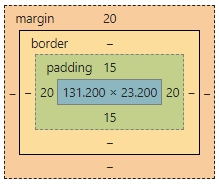

## 請找出三個課程裡面沒提到的 HTML 標籤並一一說明作用。
- <table> : 表格，可用 th(table head) 設定表頭，td(table detail) 設定表身，外層都要用tr(table row) 包起來。
- <nav> : 目錄、導覽列，常與 <ul> 、<li> 一起使用。
- <input> :

## 請問什麼是盒模型（box modal）

如圖，最內層是元素內容的寬高，再來是內距及邊框。
- padding : 內距，是往內撐，與元素內容的距離，會算進元素的寬高。
- border : 邊線，邊線的寬度也會算入元素寬高。
- margin : 外距，是往外稱，與其他元素的距離。

## 請問 display: inline, block 跟 inline-block 的差別是什麼？
- inline : 無法設定元素寬高及上下的內外距，為  、<a> 、 等的預設屬性。
- block : 會自動換行(自動把marign撐滿)，可設定元素寬高。
- inline-block : 不會自動換行，可並排，可設定元素寬高。

## 請問 position: static, relative, absolute 跟 fixed 的差別是什麼？

- static : 預設，會依照 normal flow 排列。
- relative : 相對定位，要使用absolute的話要在父元素設定relative，不會特別影響排版，但是可以設定 left 、top等來偏移元素。
- absolute : 會跳脫 normal flow ，不會佔到空間，元素會重疊，可設定 left 、top等來偏移元素。
- fixed : 會固定在螢幕的某處，捲動 scroll bar 也不會移動，通常用在目錄選單或返回頂部按鈕。
